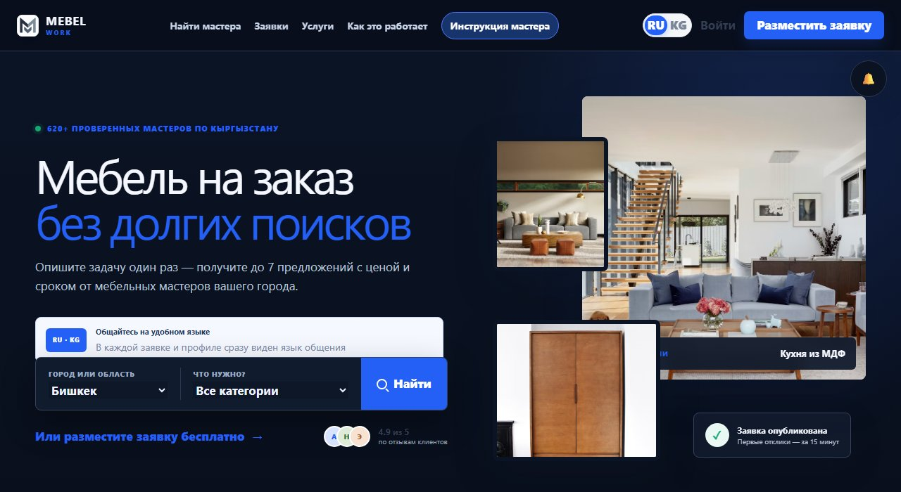
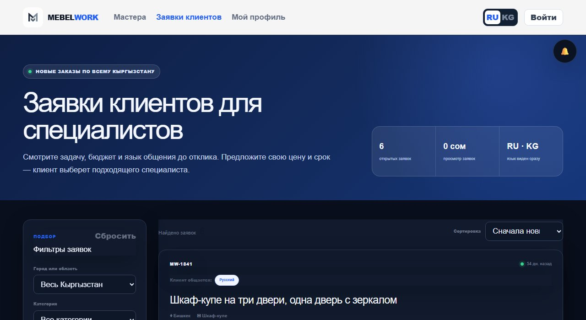
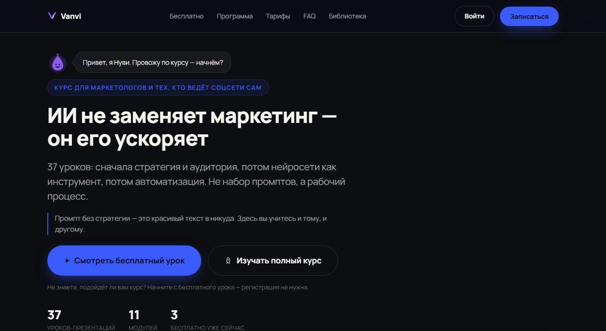
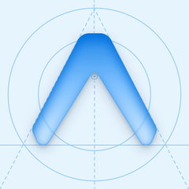
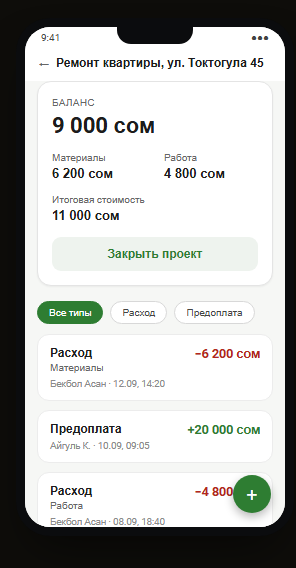
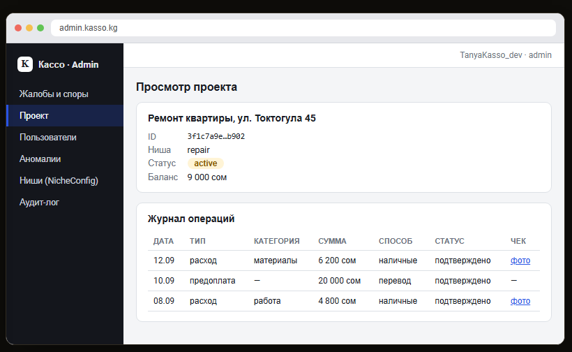
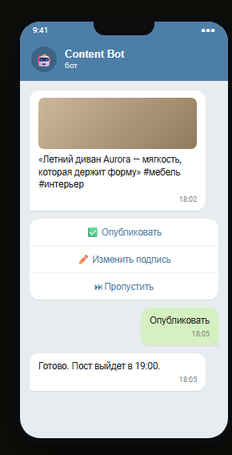
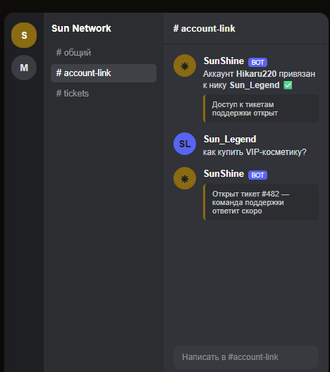

# Hikaru220

**Full-stack & mobile разработчик** — веб, мобайл, бэкенд, игровые серверы.

🟢 Открыт для фриланс-проектов и стажировок — набираю опыт.

Шесть систем в проде и в активной разработке — от маркетплейса с банковским OTP-платежом до собственной сети Minecraft с кросс-серверной синхронизацией. Ниже — не лендинги, а рабочий код с настоящими пользователями, деньгами и деплоями.

`6 проектов` · `≈94 000 строк кода` · `5 языков: JS/TS, Python, Kotlin, Java, SQL` · `19 плагинов в одной только игровой сети`

Живая версия портфолио: https://hikaru220.github.io/My-Work/

## Подход

- **Строю инфраструктуру, а не демо** — сам настраиваю деплой, аутентификацию и платежи, а не оставляю их «на потом».
- **Пишу своё, когда чужое не подходит** — свой рендер слайдов, свой изометрический движок, свой relay между серверами — там, где готовые библиотеки не закрывали задачу.
- **Документирую компромиссы** — например, два готовых бэкенда публикации в SMM-боте намеренно выключены до готовности инфраструктуры, а не забыты.

## Стек

| | |
|---|---|
| **Backend** | Node.js / Express, NestJS + TypeORM, FastAPI + SQLAlchemy (async), aiogram 3, Next.js на Cloudflare Workers |
| **Мобайл** | React Native / Expo + TypeScript, нативный Kotlin + Jetpack Compose |
| **Данные** | PostgreSQL, MySQL, SQLite, Cloudflare D1 + Drizzle ORM, R2 — от офлайн-first базы до релей-таблиц между серверами |
| **Игры / JVM** | Java 21, Paper API, Maven / Gradle |
| **Интеграции** | OAuth2, Telegram Bot API, банковский OTP-платёж (mbank), платёжные вебхуки, Gemini AI, JDA (Discord), LuckPerms/PlaceholderAPI |

## Проекты

### Mebel Work — маркетплейс мебельных мастеров
`Next.js 16 (App Router)` `Cloudflare Workers` `D1 + Drizzle ORM` `R2` `Google / Telegram OAuth`

Двусторонний маркетплейс мебельных мастеров в Кыргызстане: клиент один раз описывает задачу и получает до 7 предложений с ценой и сроком от проверенных мастеров своего города; оплата лидов и подписок идёт через встроенный кошелёк с пополнением через банковский OTP-платёж.

- Полноценная интеграция с межбанковским OTP-платёжным шлюзом Кыргызстана: старт → подтверждение кодом → поллинг статуса, с идемпотентностью и блокировкой после исчерпанных попыток
- Next.js работает воркером на Cloudflare (D1 + R2 + трансформация изображений), плюс запасной путь деплоя — тот же wrangler в Docker на VPS
- 20+ таблиц данных: заявки клиента → платные отклики мастеров по цене категории → выбор специалиста, плюс кошелёк, рефералка и подписка «Мастер+»
- Билингвальный интерфейс (RU/KY) и уведомления о новых откликах в WhatsApp, Telegram и web-push

### Vanvi — платформа онлайн-курса
`Node.js/Express` `SQLite` `JWT + Google OAuth` `Python (сборка контента)` `nginx/systemd/VPS`

Коммерческая платформа курса «ИИ в маркетинге» для рынка Кыргызстана: не лендинг, а полный продукт — платный доступ к урокам, личный кабинет, партнёрская программа и админка, всё написано и задеплоено с нуля.

- Собственный вьювер слайдов на JPEG-рендере вместо Office Online Viewer — обходит отсутствие полноценного Fullscreen API на iOS Safari
- Оплата через платёжный шлюз с идемпотентным вебхуком — защита от повторной выдачи тарифа при ретраях провайдера
- Python-пайплайн конвертирует 55 презентаций в 38 уроков и 21 статью библиотеки (LibreOffice → PyMuPDF → JPEG)
- Отдельный Telegram-бот (~1400 строк) ведёт партнёрскую программу с синхронизацией в Google Sheets

### PlanScan — обмер помещений

`React Native/Expo` `TypeScript` `SQLite (offline-first)` `react-native-svg`

Приложение для ремонтных и строительных бригад: сфотографировать комнату, обвести план поверх фото, откалибровать масштаб по длине одной стены — и сразу получить площадь, объём, 3D-превью мебели и PDF-смету.

- Калибровка всего плана по одной известной стене — площадь и объём считаются формулой шнурования, без AR и LiDAR
- Собственный изометрический 3D-движок (~35 строк) — проекция и мебель рисуются обычными SVG-полигонами
- Редактор плана с перетаскиванием точек и проёмов — на голом `PanResponder`, без сторонних canvas-библиотек
- Офлайн-first: локальная SQLite со схемой миграций и готовой очередью синхронизации под будущий бэкенд

 

### Kasso — взаиморасчёты подрядчик↔клиент
`NestJS + TypeORM` `PostgreSQL` `React + Vite (admin)` `Kotlin + Jetpack Compose`

Сервис для мастеров, дизайнеров и организаторов мероприятий в Кыргызстане: клиент вносит предоплату, подрядчик фотографирует чеки расходов и фиксирует свою работу — приложение ведёт баланс и считает итоговый расчёт при закрытии проекта.

- Три независимых клиента (backend, веб-админка, нативный Android) поверх одного REST API
- Финансовая логика (баланс, автомат закрытия сделки, тарифы) вынесена в чистый слой без побочных эффектов, полностью покрытый юнит-тестами
- Паттерн адаптеров под каждую внешнюю интеграцию (SMS, OCR, пуши, оплата, сторедж) — весь стек поднимается локально в mock-режиме без единого боевого ключа
- ~10 500 строк backend + ~13 400 строк Kotlin на мобильном клиенте, 20 контроллеров, 19 миграций БД

 

Экраны — воссозданный интерфейс на реальных компонентах и стилях проекта (пример данных, без живого бэкенда).

### Автопилот для соцсетей мебельного бренда
`Python/FastAPI` `aiogram 3 (FSM)` `SQLAlchemy async` `Gemini AI` `ffmpeg`

Telegram-бот с человеком в контуре ведёт Instagram/Facebook небольшого мебельного бренда в Центральной Азии: подбирает фото из общей папки на Google Drive, пишет подписи и обложки через AI, собирает Ken Burns-видео из статики и присылает оператору на подтверждение перед публикацией.

- Кроме команд есть роутер на естественном языке — оператор может писать боту обычным текстом
- Два полностью готовых и протестированных бэкенда публикации (прямой Meta Graph API и Metricool) сознательно оставлены выключенными до прохождения Meta App Review — задокументированное решение «построить про запас, не тянуть скоуп»
- ~2200 строк тестов (123 теста, все внешние вызовы замоканы) на ~3000 строк прикладного кода
- Маскирование секретов в логах и graceful-деградация при отключённых интеграциях (Drive, Metricool, ffmpeg)

Экран — воссозданный интерфейс бота (пример данных, без реального Telegram-аккаунта).

### Sun Network — экосистема плагинов Minecraft
`Java 21` `Paper API` `Maven/Gradle` `MySQL` `JDA (Discord)`

Инфраструктура собственной игровой сети: 19 самописных Java-плагинов (~22 000 строк) — экономика и косметика, кросс-серверная синхронизация, модерация и интеграция с Discord — вместо готовых решений с маркетплейса.

- Кросс-серверный relay поверх общих таблиц MySQL с асинхронным поллингом — три плагина синхронизации переиспользуют один паттерн вместо Redis
- SunShine — мост Paper↔Discord на JDA: привязка аккаунтов, заявки в стаф, встроенный тикет-бот поддержки (~3100 строк)
- SunArtifacts — система магических артефактов с уникальными в мире предметами и структурными анлоками (~9100 строк, самый крупный плагин сети)
- Восстановление потерянного исходника экономического плагина: декомпиляция через CFR и ручной патч байткод-производного кода для новой фичи

Экран — воссозданный интерфейс Discord-моста SunShine (пример данных).

## Контакты

Открыт для фриланс-проектов и стажировок — пишите в Telegram, отвечаю быстро.

- Telegram: [@H1karu_2](https://t.me/H1karu_2)
- GitHub: [github.com/Hikaru220](https://github.com/Hikaru220)
